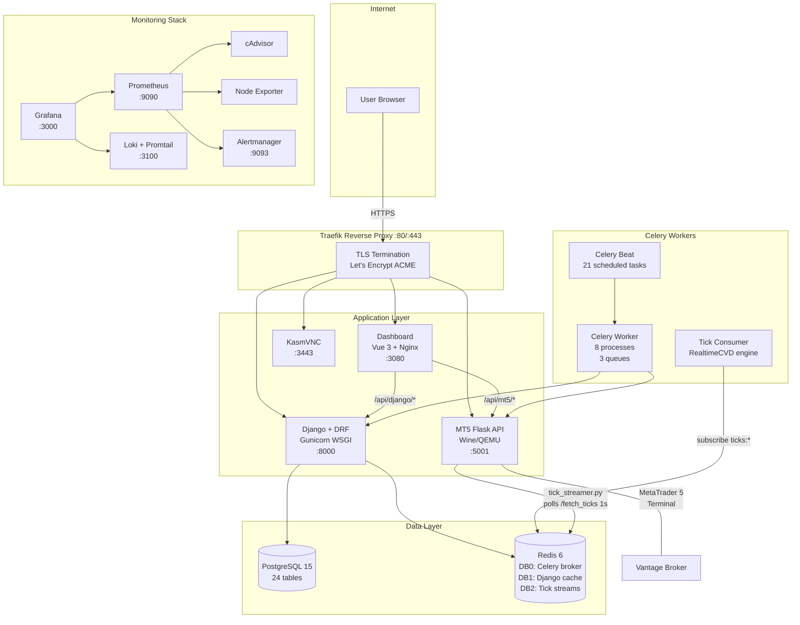
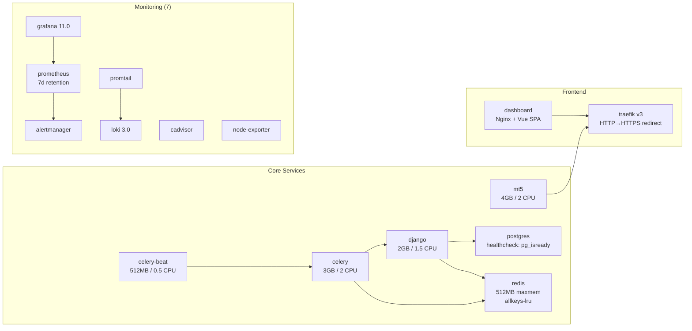
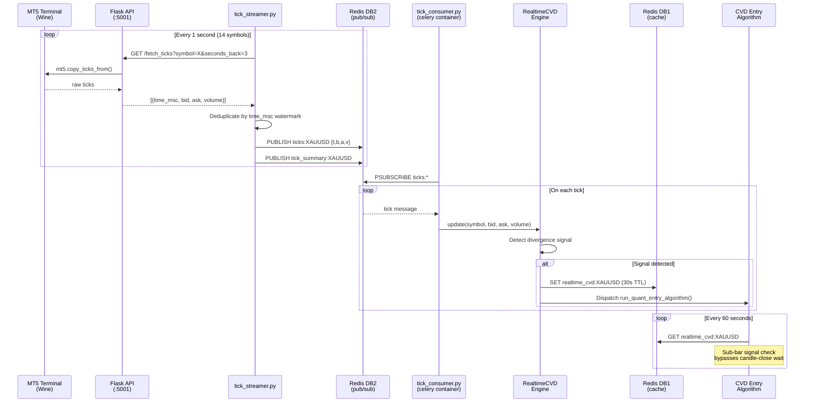
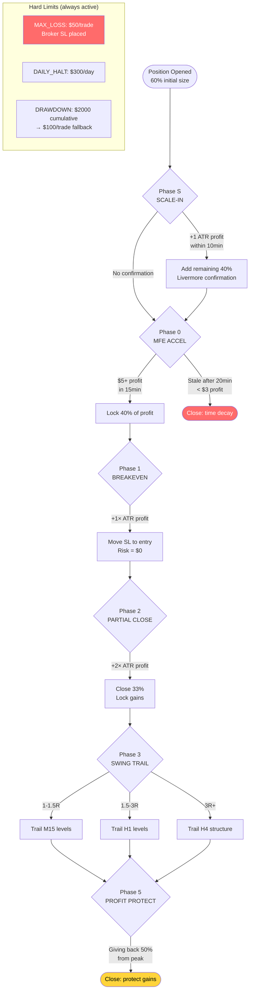
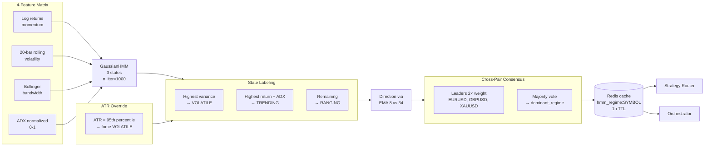
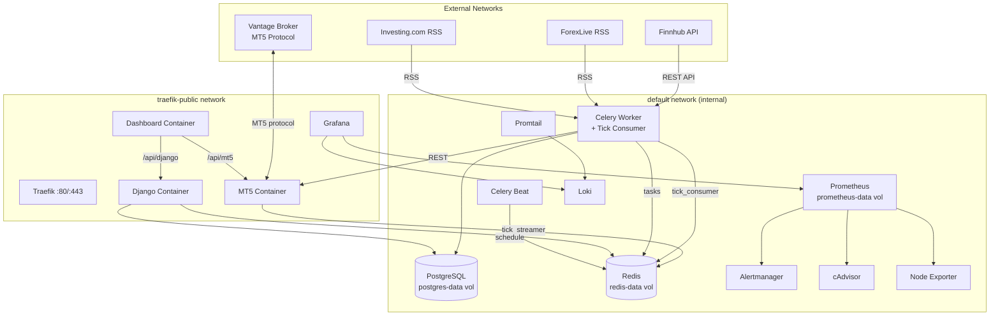
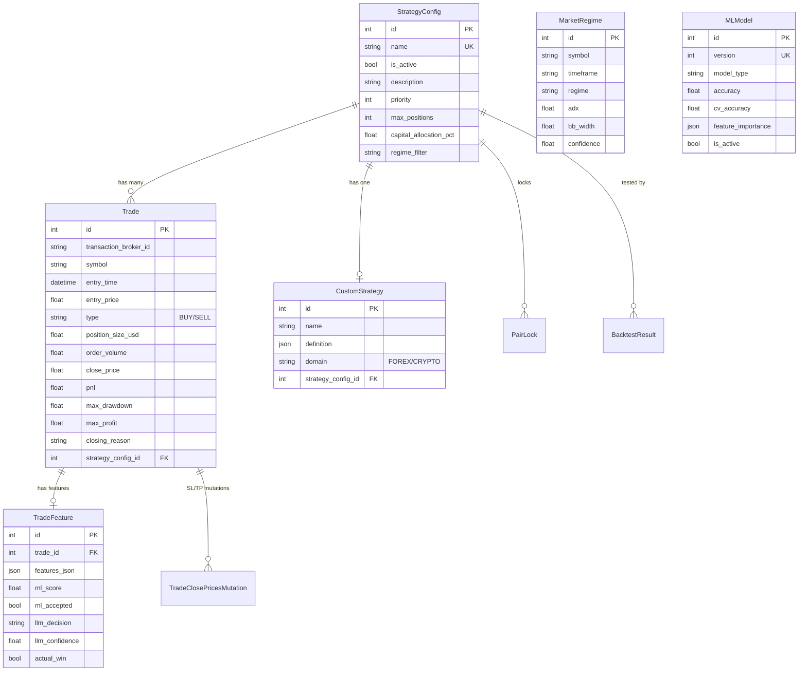

# MT5 Quant Server — Architecture Reference

> Last updated: 2026-03-15 | Paper trading run: Mar 15–31

## Infrastructure Overview



## Docker Services (16 containers)



## Tick Data Pipeline



## Entry Pipeline (10-Layer Filter Chain)

```mermaid
flowchart TD
    START([Celery Beat<br>every 60s]) --> PAUSE{Bot<br>Paused?}
    PAUSE -->|Yes| SKIP1([Skip])
    PAUSE -->|No| HALT{Daily Halt?<br>$300/day loss}
    HALT -->|Triggered| SKIP2([Halt all trading])
    HALT -->|Clear| STRATS[Load active strategies<br>ordered by priority]

    STRATS --> LOOP{For each<br>strategy}
    LOOP --> MAXPOS{Global positions<br>< 10?}
    MAXPOS -->|No| DONE([Done])
    MAXPOS -->|Yes| PERFGATE{Live performance<br>WR > 25%<br>last 4h?}
    PERFGATE -->|Fail| LOOP
    PERFGATE -->|Pass| ROUTE{Route to<br>algorithm}

    ROUTE -->|CustomStrategy| CVD[CVD Entry Algorithm]
    ROUTE -->|SCALPING| SCALP[Scalp Entry]
    ROUTE -->|MEAN_REVERSION| MR[MR Entry]

    CVD --> L1{Layer 1<br>Time Filter<br>Market open?}
    L1 -->|Blocked| REJECT([No Trade])
    L1 -->|Pass| L2{Layer 2<br>Circuit Breaker<br>3 sym / 5 global}
    L2 -->|Tripped| REJECT
    L2 -->|Pass| L3{Layer 3<br>Symbol Filter<br>WR >= 35%?}
    L3 -->|Fail| REJECT
    L3 -->|Pass| L4{Layer 4<br>Market Context<br>High-impact event?}
    L4 -->|NFP/FOMC/CPI| REJECT
    L4 -->|Clear| L5{Layer 5<br>Strategy Router<br>Regime match?}
    L5 -->|Mismatch| SIZE_PEN[Size × 0.5]
    L5 -->|Match| L6
    SIZE_PEN --> L6{Layer 6<br>Group Tendency<br>Peer pairs agree?}
    L6 -->|Disagree| SIZE_PEN2[Size × 0.5]
    L6 -->|Agree| L7
    SIZE_PEN2 --> L7{Layer 7<br>ML Meta-Filter<br>XGBoost P(win)?}
    L7 -->|Reject| REJECT
    L7 -->|Accept| SIGNAL[Signal Detection<br>Evaluate conditions]

    SIGNAL --> NOSIG{Signal<br>found?}
    NOSIG -->|No| REJECT
    NOSIG -->|Yes| CHURN{Anti-Churn<br>30s cooldown}
    CHURN -->|Too soon| REJECT
    CHURN -->|Clear| CONFLUENCE[Score Confluence<br>0-11 points]

    CONFLUENCE --> GATE{Score >=<br>min_confluence?}
    GATE -->|< min| REJECT
    GATE -->|0-2| REJECT
    GATE -->|3| REDUCED[50% size]
    GATE -->|4-7| FULL[100% size]
    GATE -->|8-11| ENHANCED[150% size]

    REDUCED --> SIZING[Dynamic Position Sizing<br>ATR × streak × WR × regime]
    FULL --> SIZING
    ENHANCED --> SIZING

    SIZING --> ORDER[send_market_order<br>SL: 1.8× ATR | TP: 3.6× ATR<br>1:2 R:R]
    ORDER --> DB[(Create Trade<br>+ TradeFeature)]

    style REJECT fill:#ff6b6b,color:#fff
    style ORDER fill:#51cf66,color:#fff
    style CONFLUENCE fill:#ffd43b,color:#000
```

## ICT 5-Step Scanner (Parallel to CVD)

```mermaid
flowchart LR
    SCAN([run_ict_scanner<br>every 60s]) --> S1

    subgraph Steps["5-Step ICT Chain (M15)"]
        S1[Step 1<br>HTF Bias H4<br>EMA 8/34 + swing] -->|bullish/bearish| S2
        S2[Step 2<br>Liquidity Sweep<br>sell-side or buy-side] -->|sweep detected<br>within 20 bars| S3
        S3[Step 3<br>Market Structure Shift<br>CHoCH or BOS] -->|after sweep<br>temporal order| S4
        S4[Step 4<br>Fair Value Gap<br>unmitigated FVG] -->|after MSS<br>direction match| S5
        S5[Step 5<br>Price at FVG<br>current price in zone]
    end

    S5 -->|All 5 confirmed| EXEC

    subgraph Execution["A+ Setup Execution"]
        EXEC[Compute SL/TP<br>SL: sweep extreme + ATR buffer<br>TP: HTF S/R level<br>Min R:R 1.5:1]
        EXEC --> CONF[Confluence: 9+<br>HTF 2 + sweep 2<br>+ FVG 1 + disp 1]
        CONF --> PLACE[Place order at<br>FVG midpoint]
    end

    style S1 fill:#74c0fc
    style S2 fill:#74c0fc
    style S3 fill:#74c0fc
    style S4 fill:#74c0fc
    style S5 fill:#74c0fc
    style PLACE fill:#51cf66,color:#fff
```



## Position Management (6 Phases)



## HMM Regime Detection



## Celery Task Schedule

```mermaid
gantt
    title Celery Beat — Task Frequencies
    dateFormat X
    axisFormat %S

    section Critical Queue
    trailing_stop (2s)       :crit, 0, 2
    close_algorithm (15s)    :crit, 0, 15
    entry_algorithm (60s)    :crit, 0, 60

    section Analysis Queue
    ict_scanner (60s)        :active, 0, 60
    regime_scan (5m)         :active, 0, 300
    strategy_orchestrator (5m) :active, 0, 300
    ml_retrain (30m)         :active, 0, 1800

    section Default Queue
    tick_health (60s)        :0, 60
    market_pulse (2m)        :0, 120
    crypto_entry (60s)       :0, 60
    crypto_exit (30s)        :0, 30
    backtest (6h)            :0, 21600
```



## Network & Data Flow



## Django API Endpoints

### Nexus (Forex) — `/v1/`

| Endpoint | Method | View | Purpose |
|----------|--------|------|---------|
| `trades/` | CRUD | TradeViewSet | Trade records |
| `strategies/` | CRUD | StrategyViewSet | Strategy configs |
| `custom-strategies/` | CRUD | CustomStrategyViewSet | JSON-defined strategies |
| `send_market_order/` | POST | SendMarketOrderView | Manual order placement |
| `modify_sl_tp/` | POST | ModifySLTPView | Modify SL/TP on position |
| `bot/status/` | GET/POST | BotControlView | Pause/resume bot |
| `logs/` | GET | LogsView | Application logs |
| `ai-brain/` | GET/POST | AIBrainControlView | AI brain toggle |
| `ai-brain/logs/` | GET | AIBrainLogsView | AI analysis history |
| `market-pulse/` | GET | MarketPulseView | News + calendar |
| `market-regime/` | GET | MarketRegimeView | ADX/BB/ATR regimes |
| `hmm-regimes/` | GET | HMMRegimeView | HMM state per pair |
| `confluence-scores/` | GET | ConfluenceScoreView | Score distribution |
| `ict/scan/` | GET/POST | ICTScanView | ICT setup results |
| `ml/status/` | GET | MLStatusView | Model info |
| `ml/predictions/` | GET | MLPredictionsView | Recent predictions |
| `ml/backfill-llm/` | POST | MLBackfillLLMView | LLM training backfill |
| `pair-locks/` | GET | PairLocksView | Active pair locks |
| `rotation-log/` | GET | RotationLogView | Strategy rotation history |
| `finnhub/calendar/` | GET | FinnhubEconomicCalendarView | Economic events |
| `finnhub/news/` | GET | FinnhubMarketNewsView | Market news |
| `finnhub/candles/` | GET | FinnhubCandlesView | Finnhub OHLCV |
| `finnhub/indicators/` | GET | FinnhubIndicatorsView | Technical indicators |
| `backtest/run/` | POST | MultiSourceBacktestView | Run backtest |
| `backtest/all/` | POST | BacktestAllView | Backtest all strategies |
| `training/config/` | GET/POST | TrainingConfigView | ML training config |
| `training/start/` | POST | TrainingStartView | Trigger training |
| `training/status/` | GET | TrainingStatusView | Training progress |
| `training/history/` | GET | TrainingHistoryView | Past training runs |

### Crypto — `/v1/crypto/`

| Endpoint | Method | View | Purpose |
|----------|--------|------|---------|
| `positions/` | CRUD | CryptoPositionViewSet | Crypto positions |
| `trades/` | CRUD | CryptoTradeViewSet | Crypto trades |
| `backtests/` | CRUD | CryptoBacktestViewSet | Crypto backtests |
| `bot/status/` | GET/POST | CryptoBotControlView | Crypto bot control |
| `funding-arb/` | GET | CryptoFundingArbView | Arb opportunities |
| `funding-rates/` | GET | CryptoFundingArbView | Current rates |
| `logs/` | GET | CryptoLogsView | Crypto logs |
| `dashboard/` | GET | CryptoDashboardView | Crypto overview |
| `wallet/` | GET | CryptoWalletView | Wallet balance |
| `strategy/` | GET/POST | CryptoStrategyConfigView | Strategy config |

### MT5 Flask API — `:5001`

| Endpoint | Method | Purpose |
|----------|--------|---------|
| `/health` | GET | MT5 connection status |
| `/order` | POST | Place market order |
| `/close_position` | POST | Close position by ticket |
| `/close_all_positions` | POST | Close all (optional filter) |
| `/modify_sl_tp` | POST | Modify SL/TP |
| `/get_positions` | GET | Open positions |
| `/positions_total` | GET | Position count |
| `/symbols_get` | GET | Available symbols |
| `/symbol_info/<symbol>` | GET | Symbol details |
| `/symbol_info_tick/<symbol>` | GET | Latest tick |
| `/fetch_data_pos` | GET | OHLCV bars (max 100) |
| `/fetch_data_range` | GET | OHLCV by date range |
| `/fetch_ticks` | GET | Raw ticks |
| `/get_deal_from_ticket` | GET | Deal history |
| `/get_order_from_ticket` | GET | Order history |
| `/history_deals_get` | GET | Deals in date range |
| `/history_orders_get` | GET | Orders by ticket |

## Database Schema



## Risk Management Summary

| Parameter | Forex | Energy | Location |
|-----------|-------|--------|----------|
| Capital/Trade | $2,000 | $300 | `cvd/config.py` |
| SL (ATR mult) | 1.8× | 2.0× | `cvd/config.py` |
| TP (ATR mult) | 3.6× | 4.0× | `cvd/config.py` |
| Risk:Reward | 1:2 | 1:2 | Computed |
| Max Loss/Trade | $50 | $50 | `entry.py:80` |
| Max Open (strategy) | 5 | 2 oil + 1 NG | `config.py` / `ENERGY_RISK_CONFIG` |
| Max Open (global) | 10 | — | `tasks.py:25` |
| Daily Halt | $300 | $150 (energy-only) | `tasks.py:26` / `config.py` |
| Drawdown Reduction | $2,000 cumulative → $100/trade | — | `tasks.py:27` |
| Circuit Breaker (symbol) | 3 consecutive losses → 1h | Same | `entry.py:57` |
| Circuit Breaker (global) | 5 consecutive losses → 1h | Same | `entry.py:58` |

## Confluence Scoring (0–11 points)

| Factor | Max Points | Source |
|--------|-----------|--------|
| HTF Bias (H4) | 2 | `mtf_analyzer.py` |
| Liquidity Sweep | 2 | `smc_detector.py` |
| CVD Divergence | 2 | `cvd.py` / `cvd_realtime.py` |
| Kill Zone | 1 | `kill_zones.py` |
| Fair Value Gap | 1 | `smc_detector.py` |
| Order Block | 1 | `smc_detector.py` |
| Regime Alignment | 1 | `regime_hmm.py` |
| Displacement | 1 | `displacement.py` |

**Score Bands:** 0-2 = skip | 3 = 50% size | 4-7 = full | 8-11 = 150% size

## File Structure

```
metatrader5-quant-server-python/
├── docker-compose.yml              # 16 services
├── docker-compose.override.yml     # Dev: no TLS, localhost
├── .env                            # Domain, API keys, DB creds
│
├── backend/
│   ├── django/
│   │   ├── Dockerfile              # Gunicorn WSGI, 8 workers
│   │   ├── requirements.txt        # UTF-16LE encoding
│   │   ├── manage.py
│   │   └── app/
│   │       ├── settings.py         # Celery config, beat schedule
│   │       ├── urls.py             # /admin, /v1/, /v1/crypto/
│   │       ├── wsgi.py / asgi.py
│   │       ├── nexus/              # Forex models, views, serializers
│   │       ├── crypto/             # Crypto models, views, tasks
│   │       ├── quant/
│   │       │   ├── tasks.py        # 21 Celery tasks
│   │       │   ├── tick_consumer.py
│   │       │   ├── strategy_orchestrator.py
│   │       │   ├── ai_brain.py
│   │       │   ├── indicators/     # 14 indicator modules
│   │       │   ├── algorithms/
│   │       │   │   ├── cvd/        # entry.py, config.py, trailing.py
│   │       │   │   ├── ict_entry.py
│   │       │   │   ├── position_manager.py
│   │       │   │   ├── strategy_router.py
│   │       │   │   ├── confluence_scorer.py
│   │       │   │   ├── regime.py
│   │       │   │   ├── mtf_analyzer.py
│   │       │   │   ├── close/
│   │       │   │   ├── scalping/
│   │       │   │   └── crypto/
│   │       │   └── ml/
│   │       │       ├── regime_hmm.py
│   │       │       ├── trainer.py
│   │       │       └── features.py
│   │       └── utils/
│   │
│   ├── mt5/
│   │   ├── Dockerfile
│   │   └── app/
│   │       ├── app.py              # Flask entry
│   │       ├── tick_streamer.py    # Polls ticks → Redis pub/sub
│   │       └── routes/             # 6 route blueprints
│   │
│   ├── dashboard/
│   │   ├── Dockerfile
│   │   ├── nginx.conf
│   │   └── src/
│   │       ├── pages/              # 19 Vue pages
│   │       ├── components/         # 16 Vue components
│   │       ├── composables/        # usePolling.js
│   │       ├── services/           # api.js (40+ endpoints)
│   │       └── stores/             # Pinia stores
│   │
│   └── lighter-proxy/              # Lighter.xyz DEX proxy
│
├── monitoring/
│   ├── configs/
│   │   ├── prometheus/             # Scrape config, alert rules
│   │   ├── grafana/                # Provisioning, plugins
│   │   ├── alertmanager/           # 5 config variants
│   │   ├── loki/                   # Log aggregation
│   │   └── promtail/               # Log shipping
│   └── dashboards/                 # 5 Grafana JSON dashboards
│
├── research/                       # Implementation plan, xaubot analysis
├── ml_models/                      # Trained models + LLM training data
└── training/                       # Remote ML training scripts
```

## Volumes (Persistent Data)

| Volume | Container | Purpose |
|--------|-----------|---------|
| `postgres-data` | postgres | Database files |
| `redis-data` | redis | AOF persistence |
| `static_volume` | django, celery, celery-beat | Django static files |
| `quant-logs` | django, celery | Log files |
| `grafana-data` | grafana | Dashboard state |
| `prometheus-data` | prometheus | 7-day TSDB |
| `traefik-public-certificates` | traefik | Let's Encrypt certs |
| `./ml_models` (bind) | django, celery | ML model artifacts |
| `./config` (bind) | mt5 | MT5 configuration |
| `~/.ssh` (bind, ro) | celery | SSH keys for git |
