# Quant Brain v1.0 — Full Dual-Domain Architecture

## System Overview

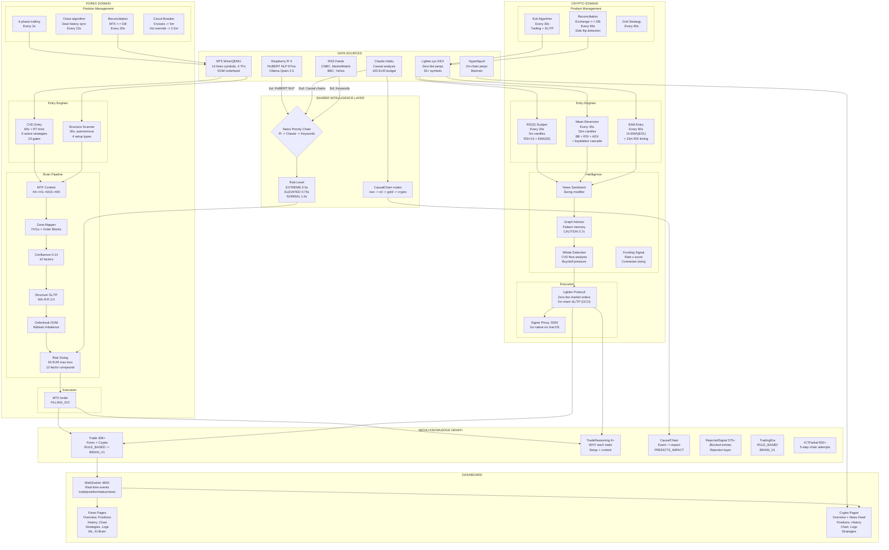

## Intelligence Flow (Shared Across Domains)

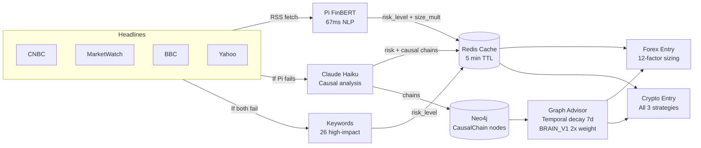

## Forex Entry Pipeline (23 Gates)

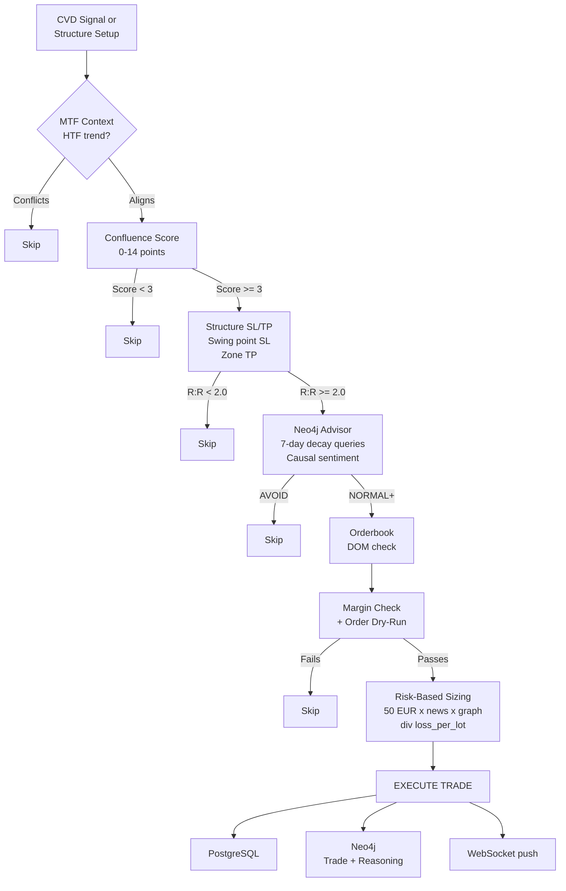

## Crypto Entry Pipeline (Unshackled — Training Mode)

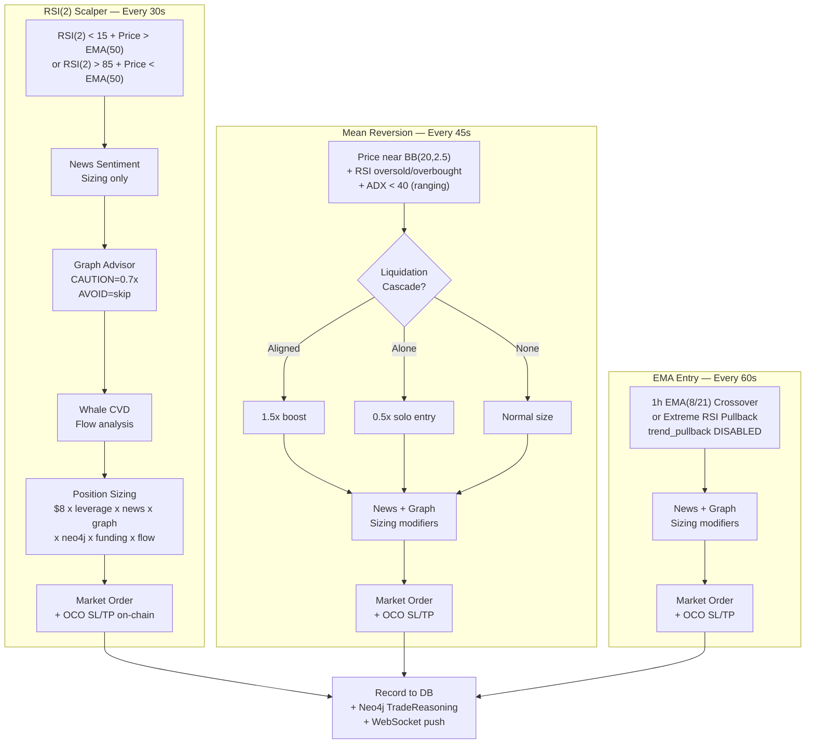

## Disabled Crypto Gates (Training Mode)

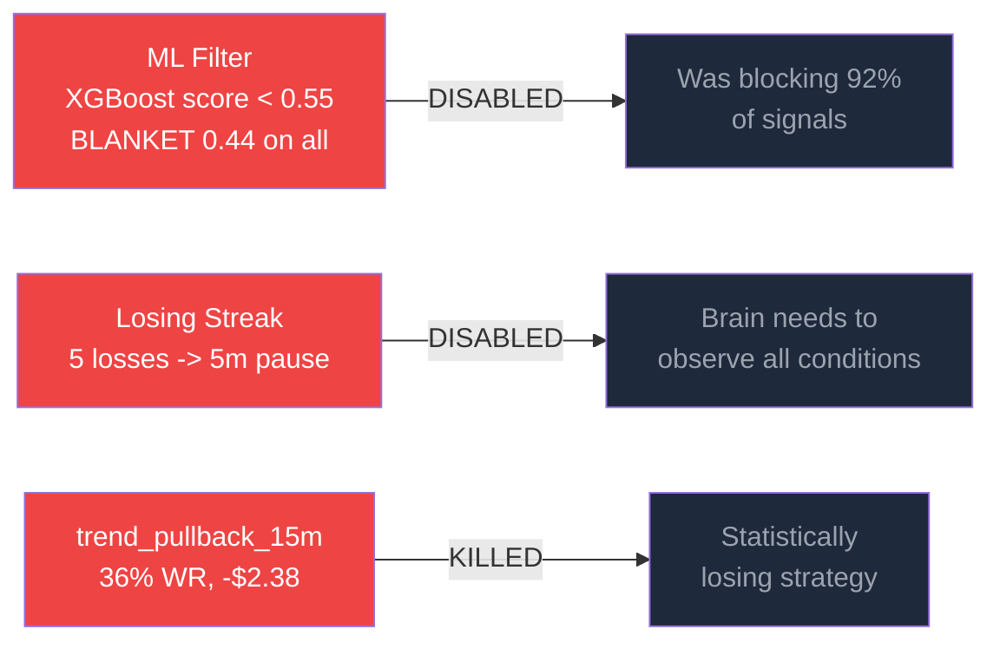

## Neo4j Knowledge Graph Schema

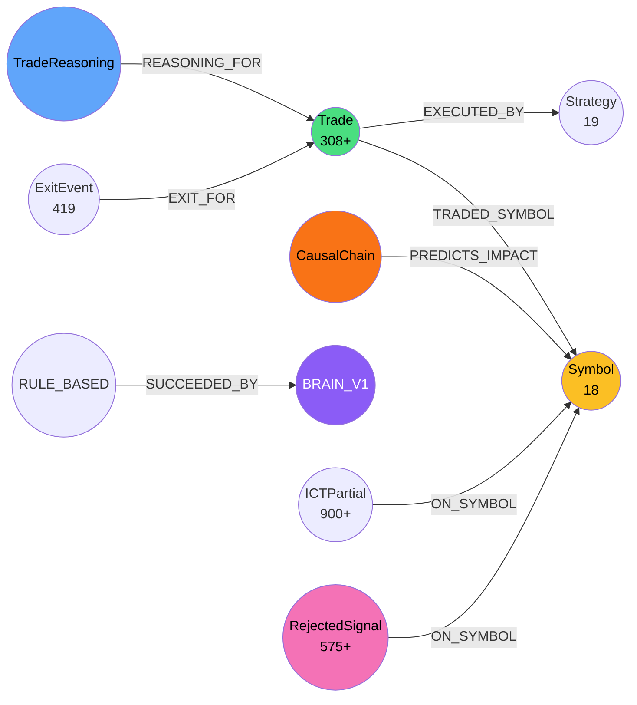

## Hardware Topology

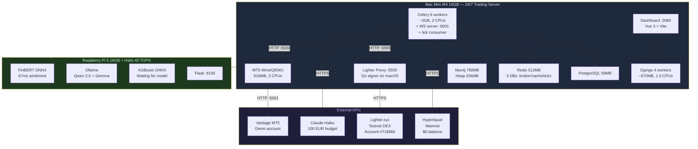

## Container Memory Budget (Optimized Mar 17)

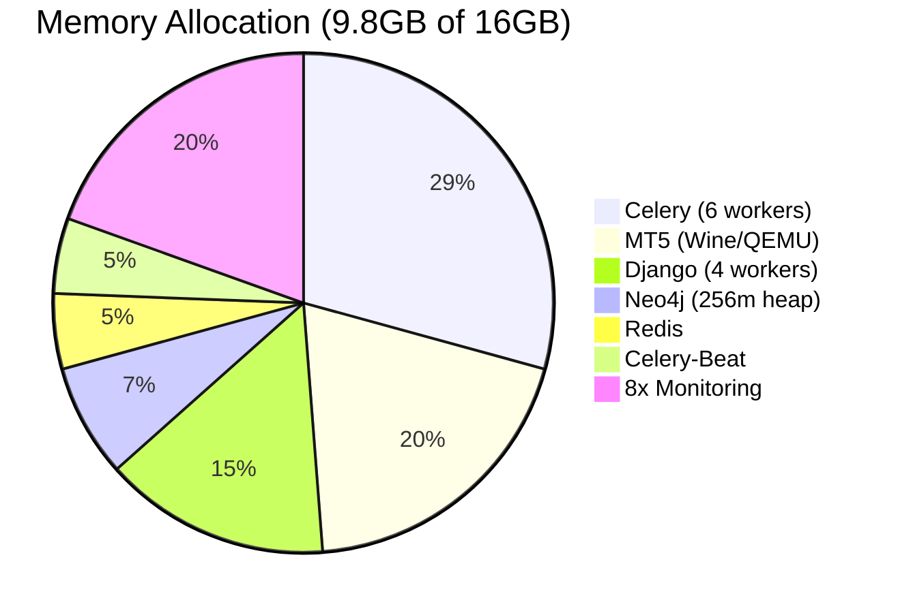

## Crypto Performance (160+ trades)

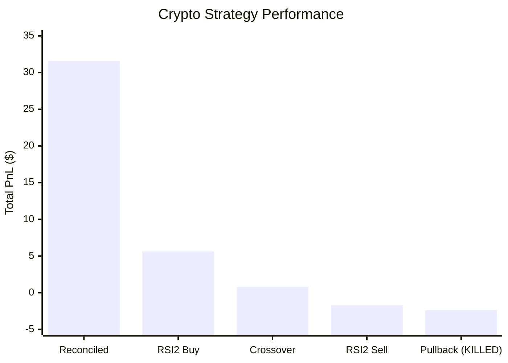

## Trading Eras Timeline

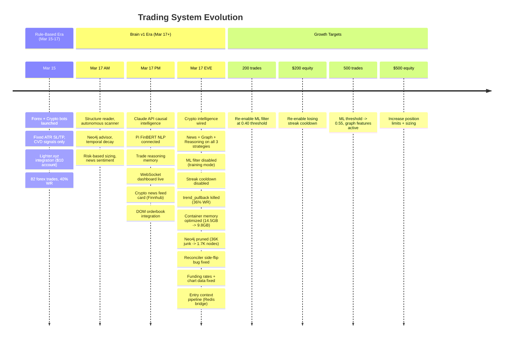

## Cross-Domain Data Flow

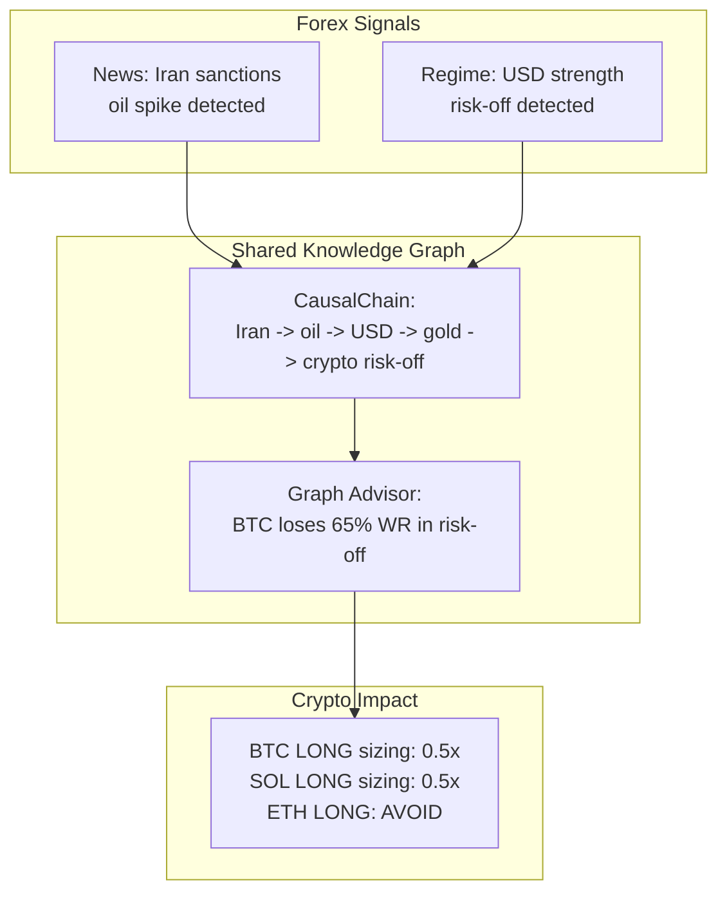
