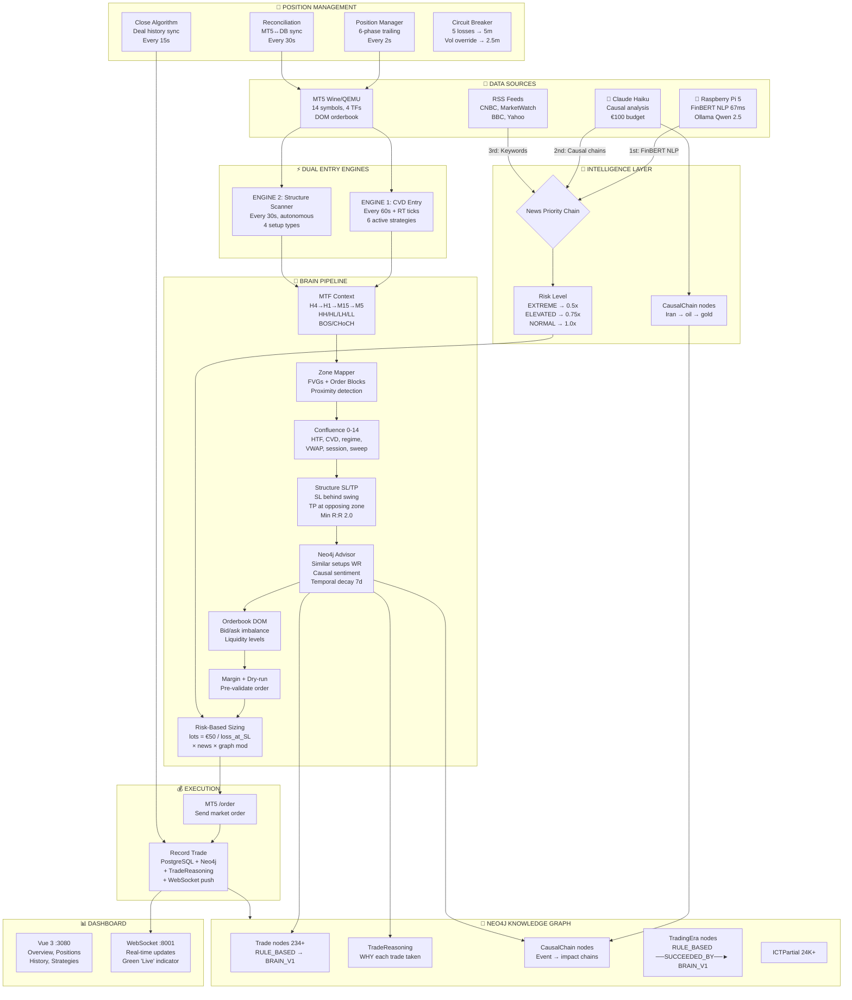
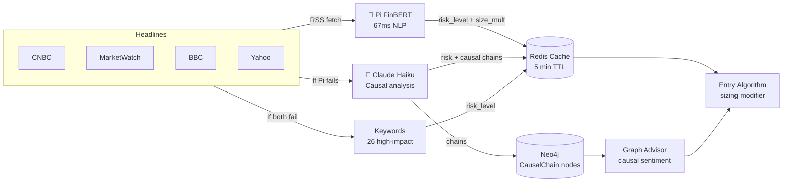
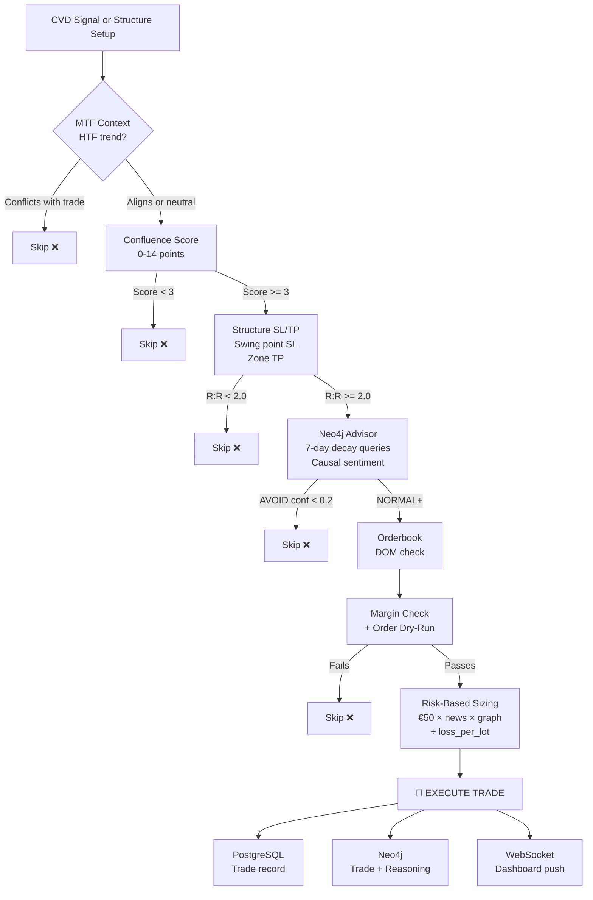
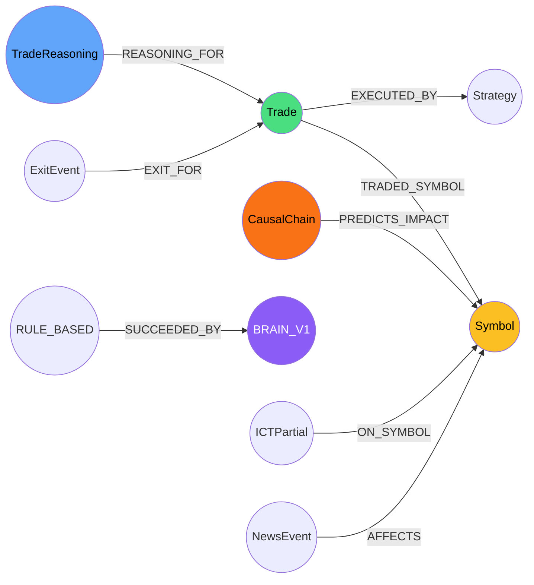
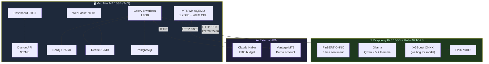
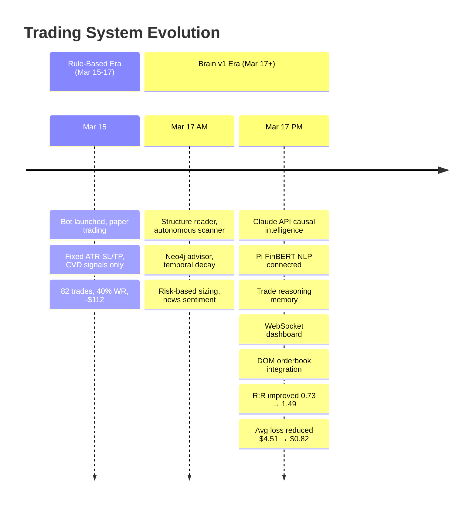

# Quant Brain v1.0 — Full Architecture

## System Overview

## Intelligence Flow

## Entry Decision Pipeline

## Neo4j Knowledge Graph Schema

## Hardware Topology

## Performance Comparison

```mermaid
xychart-beta
    title "Rule Era vs Brain Era"
    x-axis ["Avg Loss $", "R:R Ratio", "Expectancy $/trade"]
    y-axis "Value" 0 --> 5
    bar [4.51, 0.73, 1.37]
    bar [0.82, 1.49, 0.20]
```

## Trading Eras Timeline

